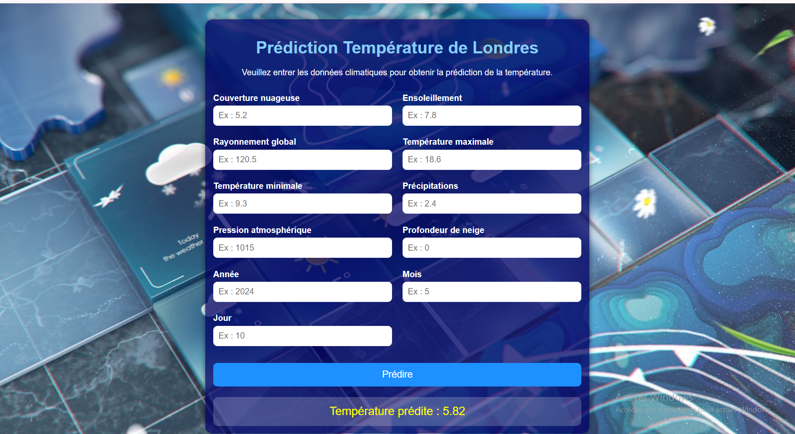

## 🌦️ Prédiction de la Température à Londres | Machine Learning & Flask

## 📌 Présentation du projet

Ce projet consiste en la création d’un **modèle de Machine Learning** capable de prédire la température à Londres à partir de plusieurs variables météorologiques, ainsi qu’au développement d’une **application web interactive avec Flask** permettant d’effectuer des prédictions en temps réel.

L’objectif est d’analyser les données climatiques historiques afin de transformer les informations météorologiques en **prédictions exploitables**, permettant d’estimer avec précision la température future.

---

# 📂 Structure du projet

## 1️⃣ Préparation et analyse des données

Cette étape est dédiée au nettoyage, à la transformation et à l’exploration des données météorologiques avant l’entraînement du modèle.

### Traitements réalisés

- Nettoyage des données
- Gestion des valeurs manquantes
- Vérification de la cohérence des variables
- Préparation des variables temporelles

### Variables utilisées

- Couverture nuageuse
- Ensoleillement
- Rayonnement global
- Température maximale
- Température minimale
- Précipitations
- Pression atmosphérique
- Profondeur de neige
- Date (année, mois, jour)

### Objectif

Préparer un jeu de données fiable et pertinent afin d’optimiser les performances du modèle prédictif.

---

## 2️⃣ Modélisation Machine Learning

Cette étape permet de construire, comparer et sélectionner le modèle le plus performant pour la prédiction.

### Méthodes utilisées

- Prétraitement des données
- Séparation des données d’entraînement et de test
- Entraînement et validation des modèles
- Comparaison des performances avec la métrique RMSE

### Modèles testés

- Linear Regression
- Random Forest Regressor
- Gradient Boosting Regressor

### Meilleur modèle sélectionné

- Gradient Boosting Regressor

### Performance du modèle

- RMSE : 0.8335

### Objectif

Développer un modèle fiable capable de prédire la température avec précision.

---

## 3️⃣ Application web Flask

Cette partie permet d’intégrer le modèle entraîné dans une interface web interactive afin de réaliser des prédictions en temps réel.

### Fonctionnalités disponibles

- Saisie des données météorologiques
- Prétraitement automatique des données
- Prédiction instantanée de la température
- Interface web intuitive et interactive

### Objectif

Rendre le modèle accessible via une application simple et intuitive pour faciliter son utilisation.

---

# 🛠️ Outils utilisés

- Python
- Flask
- Pandas
- Joblib
- Scikit-learn
- HTML / CSS

---

# 🎯 Résultats attendus

Ce projet permet de :

- Analyser des données météorologiques historiques
- Construire un pipeline complet de Machine Learning
- Comparer plusieurs modèles de régression
- Déployer un modèle prédictif dans une application web
- Réaliser des prédictions interactives de température

---

